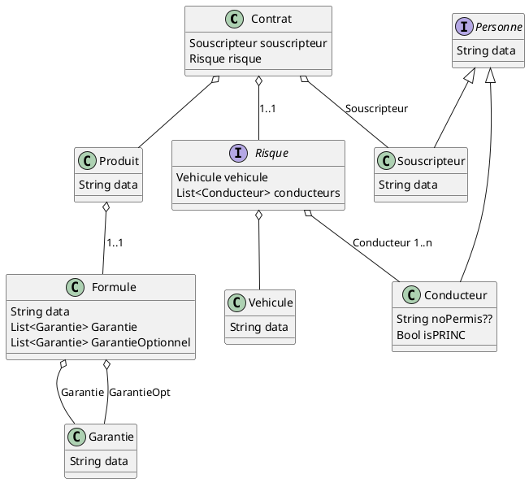

# myapi
## policie

```plantuml
@startuml
class Contrat {
  Souscripteur souscripteur
  Risque risque
}

class Produit {
  String data
}
class Formule {
  String data
  List<Garantie> Garantie
  List<Garantie> GarantieOptionnel
}
class Garantie {
  String data
}
interface Risque {
  Vehicule vehicule
  List<Conducteur> conducteurs
}
Interface Personne {
  String data
}

class Vehicule {
    String data
}
class Conducteur {
  String noPermis??
  Bool isPRINC
}
class Souscripteur {
  String data
}

Contrat o-- Risque : 1..1
Risque o-- Vehicule
Contrat o-- Souscripteur : Souscripteur
Personne <|-- Souscripteur
Risque o-- Conducteur : Conducteur 1..n
Personne <|-- Conducteur
Contrat o-- Produit
Formule o-- Garantie : Garantie
Formule o-- Garantie : GarantieOpt
Produit o-- Formule : 1..1

@enduml
```
